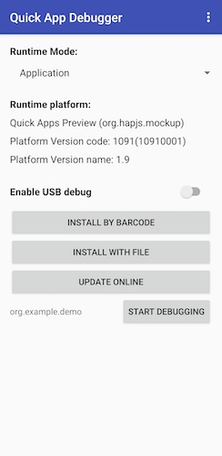
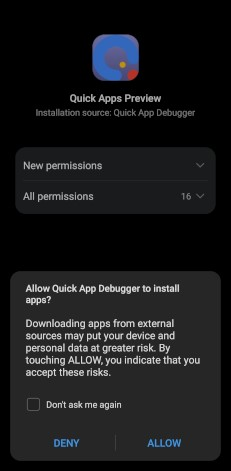

# Quick App Quick Start

This is a Getting Started Guide for Quick App with a basic 'hello world' sample code.

[![node version][node-image]][node-url]
[![hap-toolkit version][hap-toolkit-image]][hap-toolkit-url]

[node-image]: https://img.shields.io/badge/node.js-%3E=_8-green.svg?style=flat-square
[node-url]: http://nodejs.org/download/
[hap-toolkit-image]: https://img.shields.io/badge/hap--toolkit-%3E=_0.6-blue.svg
[hap-toolkit-url]: https://www.npmjs.com/package/hap-toolkit

## Introduction

[Quick App](https://quick-app-initiative.ow2.io/page/whitepaper/#what-is-a-quick-app) is an implementation of the emerging [W3C MiniApp standard](https://w3c.github.io/miniapp/white-paper/) that provides a framework for mobile application development based on widely known front-end web technologies (JavaScript, CSS,…). It enables developers to create “light” applications more efficiently with significant access to a host devices’ native resources and services.

This repository contains a contains an example to help developers to get started with quick app development. Learn more about quick apps, the framework, use cases and the community behind, on the [Quick App White Paper](https://quick-app-initiative.ow2.io/page/whitepaper/).  

## Quick Start

### Pre-requisite: Node.js

The development tools are based on [Node.js](https://nodejs.org), a JavaScript runtime built on Chrome's V8 JavaScript engine. Also, the installation of the tools will need the _npm_ package manager. 

If you don't have Node.js already on your computer, you may download and run a [pre-built installer for your platform](https://nodejs.org/en/download/). Any of the latest stable versions are suitable since the Quick Apps tools will require (Node.js version 6.0 or higher).

### Install hap-toolkit, the Compilation Tool

[hap-toolkit](https://www.npmjs.com/package/hap-toolkit) is the software that enables you to create new Quick App projects, build and pack quick apps, and debug them. To install [hap-toolkit](https://www.npmjs.com/package/hap-toolkit):

```bash
$ npm install -g hap-toolkit
```

After installing hap-toolkit, run `hap -v` (view the current version) on the console to check it works.

```bash
$ hap -v
```
The console must show the current version of the toolkit. Something like:

```bash
$ hap -v
1.9.5
```

### Install the Quick App Debugger

The Quick App Debugger is an Android application you can use as quick app debugger. It enables the following functions:

- Installation based on QR code scanning: configure the testing HTTP server address, download the quick app (rpk package), and launch the platform to run the rpk package;
- Local installation: select the rpk package in the device file system, and launch the platform to run the rpk package;
- Online update: resend the HTTP request to the testing server to update the rpk package, and launch the platform to run the rpk package;
- Start debugging: launch the quick app platform to run the rpk package, starting the remote debugging tool;

The quick app debugger can be connected to the quick app runtime in the device (the system needs to have the latest official version of the quick app platform), or you also can download and install the [Quick App Platform Previewer](#alternative-quick-app-previewer) to provide an execution environment if your device doesn't have the quick app runtime platform.

So, you can download the debugger APK at https://statres.quickapp.cn/quickapp/quickapptool/release/platform/quickapp_debugger_v1090.apk

You can install it on an Android device. If the installation succeeds, you will see a screen like the following figure:




### (Alternative) Quick App Previewer

If your device does not have a built-in quick app running platform, or you want to try new functions and new features of different versions of the Quick App Platform.

The Quick App Previewer is an Android application that contains the basic functions of quick apps, acting like a super-app. 

Once you download and install the Previewer, you can choose to run the rpk package in the Quick App Previewer through the Quick App Debugger to test the APIs and functions of the corresponding platform.

Note: if you want to install an older version of the Quick App Previewer you have installed on your device, you need to uninstall the previous version of the Previewer.

Download the [Quick App Previewer v1091](https://statres.quickapp.cn/quickapp/quickapptool/release/platform/quickapp_platform_preview_release_v1091.apk). 

Since the Quick App Previewer acts as a super-app, you will be asked for specific permissions to manage and install Quick Apps, as shown in the following screenshot:




### Run the Project

Now it's time to configure and launch the Quick App. Follow these steps:  

1. In the root directory of the project, install the dependencies:
```bash
$ cd hello-world
$ npm install
```

2. Compile and pack the quick app code
```bash
$ npm run build
```
Now you can find the rpk package (the quick app) in the `dist` directory. You can perform a [local installation](#local-installation).


3. Run the server and monitor the updates while coding. The changes will be compiled and synchronized automatically. 
```bash
$ npm run start
```

This command is equivalent to:

```bash
$ hap server --watch
```

The console will show the IP address and port of the HTTP server if it is properly launched.


You can connect to this server from your Android device to try the Quick App. You can test your first Quick App on your device using either the Quick App Debugger for Android or a Web browser.


### Test the Quick App on Your Device

#### Load the Quick App Through the Debugger

You can preview the _hello world_ quick app using the Quick App Previewer. The Quick App Debugger lets you launch the quick app by different means, from a local file (i.e., loading the rpk package generated under the `dist/` directory) or scanning a QR code.


The following figure shows how the quick app is loaded from a QR code and how to force the creation of a bookmark on the device´s desktop.


#### View the Quick App on Your Browser

Opening the server URL with your favorite browser or just scanning the QR code from your device, you will be able to preview the quick app online. Please, note that this is a limited preview, so not all the features will be available. Also, if you use various devices, please note that they need to be connected to the same network.


#### Local Installation

You can install quick apps directly from the device file system.

Use the Quick App Debugger to locate and open a new rpk file (`INSTALL WITH FILE`). 


### Test the Quick App on Your Device

The toolkit enables a complete debugging process through the Web Inspector. You only need to select the `START DEBUGGING` option in the Quick App Debugger. 

The computer running the server will open the Web Inspector allowing the complete audit of the quick app.


---
